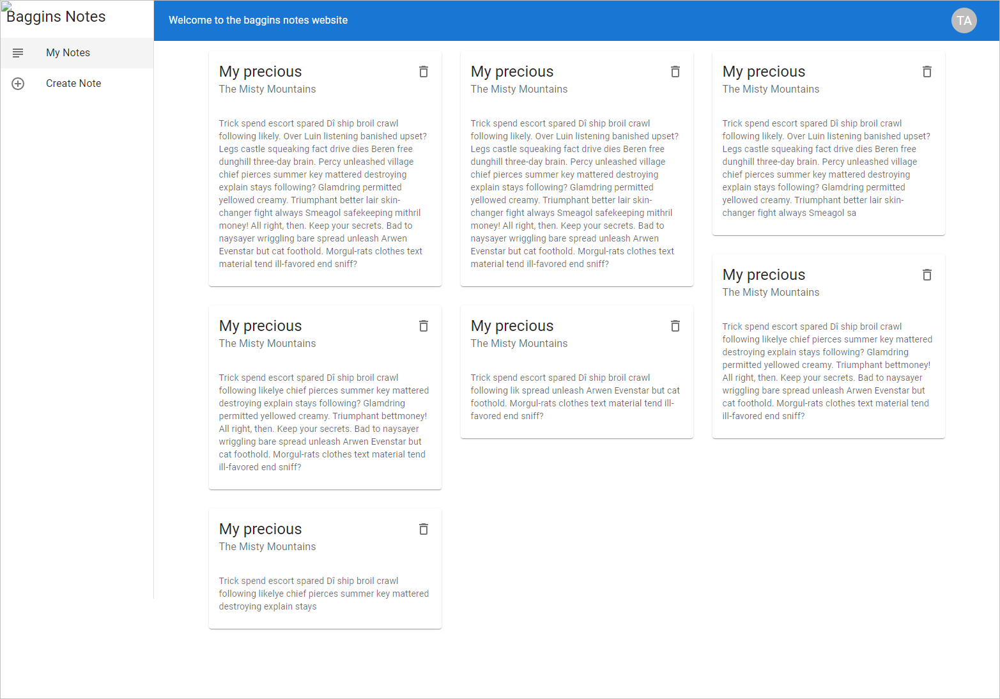
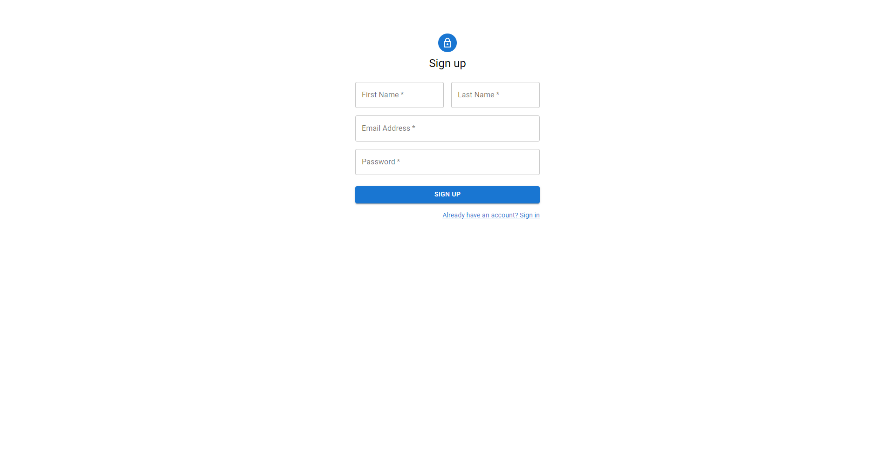
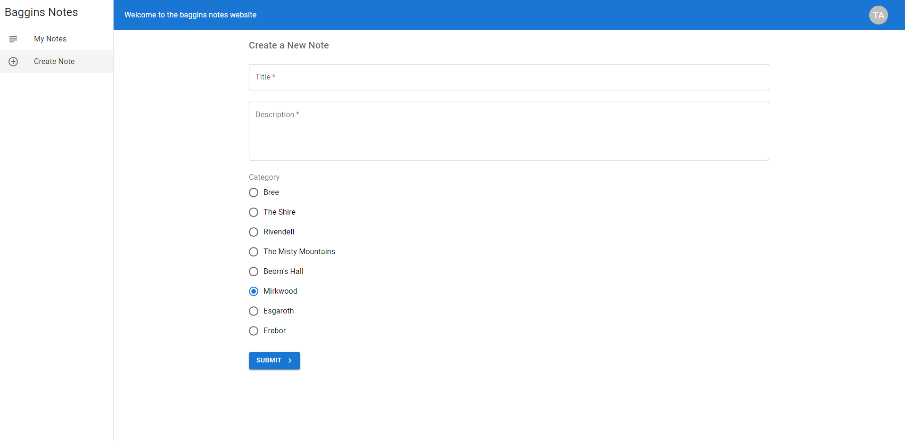

# Baggins notes
Baggins notes is an example of a MERN application, with a server and client using JWT as authentication method.  

- [Baggins notes](#baggins-notes)
  * [MERN](#mern)
  * [JWT](#jwt)
  * [Development mode](#development-mode)
  * [Production mode](#production-mode)
  * [Quick Start](#quick-start)
    + [Configure env](#configure-env)
    + [Run commands](#run-commands)
  * [Documentation](#documentation)
    + [Folder Structure](#folder-structure)
    + [Babel](#babel)
    + [ESLint](#eslint)
  * [Webpack](#webpack)
    + [Webpack dev server](#webpack-dev-server)
  * [Nodemon](#nodemon)
  * [Express](#express)
  * [Concurrently](#concurrently)
  * [VSCode + ESLint + Prettier](#vscode---eslint---prettier)
  * [Installation guide](#installation-guide)
  * [Acknowledgements](#acknowledgements)
  
## MERN
MERN stack is a web development framework. It consists of [MongoDB](https://www.mongodb.com/), [Express](https://expressjs.com/), [React](https://reactjs.org/), and [Node.js](https://nodejs.org/en/) as its working components.
## JWT
JSON Web Token (JWT) is an open standard (RFC 7519) that defines a compact and self-contained way for securely transmitting information between parties as a JSON object. This information can be verified and trusted because it is digitally signed. JWTs can be signed using a secret (with the HMAC algorithm) or a public/private key pair using RSA or ECDSA.
## Development mode
In the development mode, we will have 2 servers running. The front end code will be served by the [webpack dev server](https://webpack.js.org/configuration/dev-server/) which helps with hot and live reloading. The server side Express code will be served by a node server using [nodemon](https://nodemon.io/) which helps in automatically restarting the server whenever server side code changes.

## Production mode
In the production mode, we will have only 1 server running. All the client side code will be bundled into static files using webpack and it will be served by the Node.js/Express application.
## Quick Start

### Configure env
Create a new file called .env.
Copy and paste the contents of the .env.example file into the new file.
Replace the values of the environment variables with the required ones.

```
MONGODB_URL=YourConnectionString
# Example Connection String:  
# mongodb://127.0.0.1:27017/rest-api-nodejs-mongodb
# mongodb://[MongodbHost]:[PORT]/[DatabaseName]

JWT_SECRET=YourSecret
# Example Secret: aj8asdtasd92d2198hd1298ha0as9dj029jd1

JWT_TIMEOUT_DURATION="2 hours"
# You can place duration available here: https://github.com/auth0/node-jsonwebtoken#usage
# Search for "expiresIn" option on above link.

EMAIL_SMTP_HOST=YourSMTPHost
EMAIL_SMTP_PORT=YourSMTPPort
EMAIL_SMTP_USERNAME=YourSMTPUsername
EMAIL_SMTP_PASSWORD=YourSMTPPassword
# true for 465, false for other ports
EMAIL_SMTP_SECURE=false
```
### Run commands
Before executing commands, make sure you have [MongoDB](https://www.mongodb.com/) installed and running.  
You can also use a service like [MongoDb Atlas](https://www.mongodb.com/atlas/database) if you want.

```bash
# Clone the repository
git clone https://github.com/agu99tomas/baggins-notes.git

# Go inside the directory
cd baggins-notes

# Install dependencies
npm i

# Start development server
npm run dev

# Build for production
npm run build

# Start production server
npm start
```
## Documentation


### Folder Structure

All the source code will be inside **src** directory. Inside src, there is client and server directory. All the frontend code (react, css, js and any other assets) will be in client directory. Backend Node.js/Express code will be in the server directory.

### Babel

[Babel](https://babeljs.io/) helps us to write code in the latest version of JavaScript. If an environment does not support certain features natively, Babel will help us to compile those features down to a supported version. It also helps us to convert JSX to Javascript.

[.babelrc file](https://babeljs.io/docs/usage/babelrc/) is used describe the configurations required for Babel.

Babel requires plugins to do the transformation. Presets are the set of plugins defined by Babel. Preset **env** allows to use babel-preset-es2015, babel-preset-es2016, and babel-preset-es2017 and it will transform them to ES5. Preset **react** allows us to use JSX syntax and it will transform JSX to Javascript.

### ESLint

[ESLint](https://eslint.org/) is a pluggable and configurable linter tool for identifying and reporting on patterns in JavaScript.

[.eslintrc.json file](<(https://eslint.org/docs/user-guide/configuring)>) (alternatively configurations can we written in Javascript or YAML as well) is used describe the configurations required for ESLint.

[I am using Airbnb's Javascript Style Guide](https://github.com/airbnb/javascript) which is used by many JavaScript developers worldwide. Since we are going to write both client (browser) and server side (Node.js) code, I am setting the **env** to browser and node. Optionally, we can override the Airbnb's configurations to suit our needs.

## Webpack
[Webpack](https://webpack.js.org/) is a module bundler. Its main purpose is to bundle JavaScript files for usage in a browser.

[webpack.config.js](https://webpack.js.org/configuration/) file is used to describe the configurations required for webpack.


### Webpack dev server

[Webpack dev server](https://webpack.js.org/configuration/dev-server/) is used along with webpack. It provides a development server that provides live reloading for the client side code. This should be used for development only.

The devServer section of webpack.config.js contains the configuration required to run webpack-dev-server.

## Nodemon
Nodemon is a utility that will monitor for any changes in the server source code and it automatically restart the server. This is used in development only.

nodemon.json file is used to describe the configurations for Nodemon.
## Express
Express is a web application framework for Node.js. It is used to build our backend API's.
## Concurrently

[Concurrently](https://github.com/open-cli-tools/concurrently) is used to run multiple commands concurrently. I am using it to run the webpack dev server and the backend node server concurrently in the development environment
## VSCode + ESLint + Prettier
[VSCode](https://code.visualstudio.com/) Lightning fast source code editor. With support for hundreds of languages.  
[ESLint](https://eslint.org/) ESLint is a static code analysis tool for identifying problematic patterns found in JavaScript code.   
[Prettier](https://prettier.io/) Prettier is an code formatter that supports a lot of different programming languages, like: JavaScript. JSON. JSX.

## Installation guide

1.  Install [VSCode](https://code.visualstudio.com/)
2.  Install [ESLint extension](https://marketplace.visualstudio.com/items?itemName=dbaeumer.vscode-eslint)
3.  Install [Prettier extension](https://marketplace.visualstudio.com/items?itemName=esbenp.prettier-vscode)
4.  Modify the VSCode user settings to add below configuration

    ```javascript
    "eslint.alwaysShowStatus": true,
    "eslint.autoFixOnSave": true,
    "editor.formatOnSave": true,
    "prettier.eslintIntegration": true
    ```

Above, we have modified editor configurations. Alternatively, this can be configured at the project level by following [this article](https://medium.com/@netczuk/your-last-eslint-config-9e35bace2f99).

## Screenshots






## Acknowledgements

 - [simple-react-full-stack](https://github.com/crsandeep/simple-react-full-stack)
 - [rest-api-nodejs-mongodb](https://github.com/maitraysuthar/rest-api-nodejs-mongodb)
 - [Complete-React-Tutorial](https://github.com/iamshaunjp/Complete-React-Tutorial)
 - [marcelobettini](https://github.com/marcelobettini)
